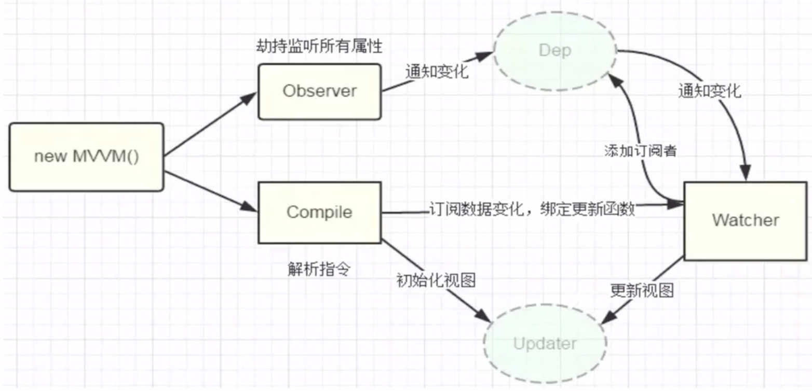

# my-vue
试着自己写一个vue的响应式

# 基于vue响应式的结构： 数据劫持 + 发布订阅模式

# 目标

1. 实现一个Compiler => 编译模板并初始化视图
2. 实现一个Observer => 数据劫持并添加依赖
3. 实现一个Watcher => 观察数据变化并更新视图
4. 实现一个Dep => 收集观察者依赖，通知观察者
5. 实现一个Updater => 更新视图的一些工具类
